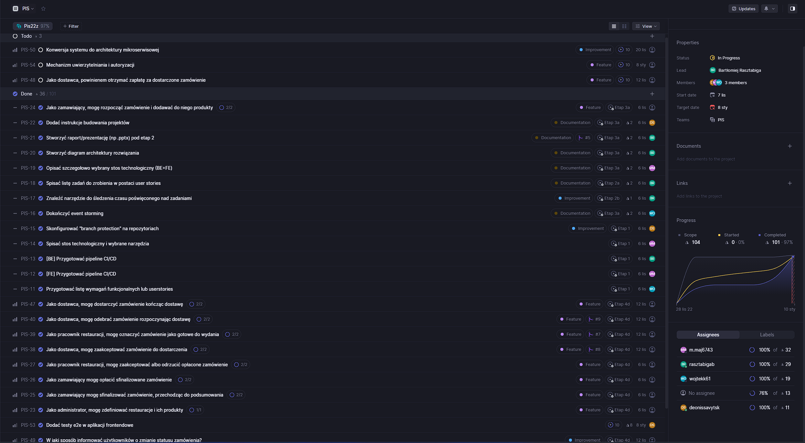
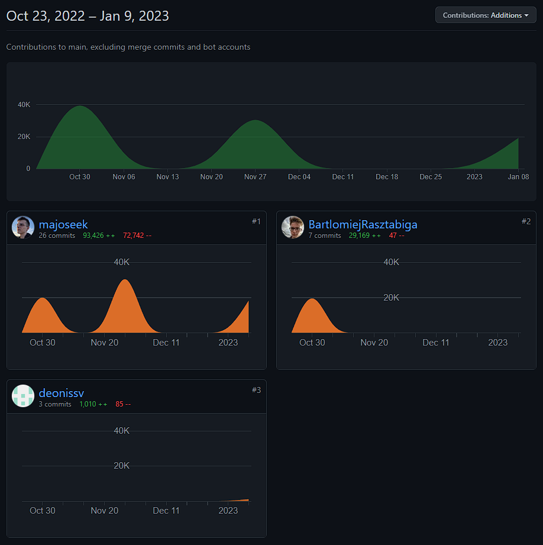

# PIS - Aplikacja do zamawiania jedzenia

## Prezentacja marketingowo-handlowa

[https://docs.google.com/presentation/d/1zgAmsCfO-fykVBQbTmsWYsFbuDOsnvWy-Q5jTxN5Eos](https://docs.google.com/presentation/d/1zgAmsCfO-fykVBQbTmsWYsFbuDOsnvWy-Q5jTxN5Eos)

PDF prezentacji znajduje się w ./miro.pdf

## Event Storming

[https://miro.com/app/board/uXjVPb5sfE4=/](https://miro.com/app/board/uXjVPb5sfE4=/)

PDF z sesji event stormingu znajduje się w ./miro.pdf. Niska jakość spowodowana jest darmową wersją Miro.

## User stories

Iteracja 1 (28 lis -> 5 gru):

- Jako zamawiający, mogę rozpocząć zamówienie i dodawać do niego produkty

Iteracja 2 (5 gru -> 19 gru):

- Jako zamawiający mogę opłacić sfinalizowane zamówienie
- Jako zamawiający mogę sfinalizować zamówienie, przechodząc do podsumowania

Iteracja 3 (19 gru -> 2 sty):

- Jako pracownik restauracji, mogę oznaczyć zamówienie jako gotowe do wydania
- Jako administrator, mogę zdefiniować restauracje i ich produkty

Iteracja 4 (2 sty -> 9 sty):

- Jako dostawca, mogę zaakceptować zamówienie do dostarczenia
- Jako dostawca, mogę odebrać zamówienie rozpoczynając dostawę
- Jako pracownik restauracji, mogę zaakceptować albo odrzucić opłacone zamówienie
- Jako dostawca, mogę dostarczyć zamówienie kończąc dostawę
- Testy e2e w aplikacji frontendowe

Nieukończone:

- Jako dostawca, powinienem otrzymać zapłatę za dostarczone zamówienie
- Konwersja systemu do architektury mikroserwisowej
- Mechanizm uwierzytelniania i autoryzacji

## Instrukcje uruchomienia komponentów systemu

- [https://github.com/PIS22Z/backend/blob/main/README.md](https://github.com/PIS22Z/backend/blob/main/README.md)
- [https://github.com/PIS22Z/frontend/blob/main/README.md](https://github.com/PIS22Z/frontend/blob/main/README.md)

## Stos technologiczny

### Środowisko

- IDE: IntelliJ IDEA + Visual Studio Code
- Hosting repozytorium: GitHub
- CI/CD: GitHub Actions
- Repozytorium artefaktów: GitHub Actions Artifacts
- Narzędzie do śledzenia zadań: Linear
- Statyczna analiza kodu: Detekt (lokalnie) + Sonar (cloud)
- Lokalne wdrożenie: docker-compose
- Wdrożenie "produkcyjne": Kubernetes

### Backend

- Język: Kotlin,
- Framework: Micronaut
- Biblioteka do testów: Spock
- Baza danych: MongoDB
- Broker wiadomości: RabbitMQ

### Frontend

- Język: TypeScript
- Framework: React.JS
- Biblioteka do testowania: Jest (unit) + Cypress (e2e)
- Biblioteka do zarządzania stanem: Recoil/Redux
- Biblioteki do stylowania: Styled-components + UI component lib (MUI/Antd)
- Integracja z API: React-query (TanStack)

## Opis architektury aplikacji

3 warstwy:

- frontend w postaci aplikacji webowej z frameworkiem React.js
- backend w postaci aplikacji serwerowej w frameworku Micronaut
- dokumentowa baza danych MongoDB

Backend podzielony jest również na 4 bounded contexty (reprezentowane w kodzie jako rozdzielone
pakiety: delivery, orders, payments, restaurants), niezależne od siebie, z minimalnymi interakcjami
pomiędzy sobą. Komunikacja między nimi odbywa się głównie asynchronicznie przez brokera wiadomości -
RabbitMQ. Całość wytwarzana jest zgodnie z koncepcją architektury heksagonalnej.

Docelowo miały to być 4 osobne mikroserwisy, jednak ze względu na ograniczenia czasowe,
zdecydowaliśmy się na wdrożenie wszystkich komponentów w jednej aplikacji.

Ze względu na komunikację asynchroniczną, aplikacja serwerowa jest skalowalna. Obecna liczba
instancji backendu na klastrze Kubernetes wynosi 3.


## Wdrożenie

Aplikacja wdrożona jest na prywatnym klastrze Kubernetes, z poniższymi elementami:

- Ingress, który obsługuje ruch przychodzący na adres pis.rasztabiga.me, kierujący na odpowiednie
  Service'y
- Deployment backendu, który odpowiada za uruchomienie 3 instancji aplikacji serwerowej
- Deployment frontendu, który odpowiada za uruchomienie 1 instancji aplikacji webowej
- StatefulSet bazy danych MongoDB, który odpowiada za uruchomienie 1 instancji bazy danych
- PersistentVolumeClaim, który odpowiada za utworzenie woluminu, na którym przechowywane są dane
  MongoDB
- Service'y, które odpowiadają za komunikację między poszczególnymi Deploymentami

Pliki konfiguracyjne znajdują się w repozytoriach:

- [https://github.com/PIS22Z/backend/tree/main/k8s](https://github.com/PIS22Z/backend/tree/main/k8s)
- [https://github.com/PIS22Z/frontend/tree/main/k8s](https://github.com/PIS22Z/frontend/tree/main/k8s)

## Demo projektu

[https://pis.rasztabiga.me/](https://pis.rasztabiga.me/)

## Raport z Linear + Śledzenie czasu



[https://linear.app/pis22z/project/pis-09dd886f8e2f/PIS](https://linear.app/pis22z/project/pis-09dd886f8e2f/PIS)

Raporty z aplikacji TrackingTime znajdują się w ./trackingtime

### Wojciech Kołodziejak

- [PIS-11](https://linear.app/pis22z/issue/PIS-11/przygotowac-liste-wymagan-funkcjonalnych-lub-userstories) 1:46h
- [PIS-31](https://linear.app/pis22z/issue/PIS-31/be) 2:56h
- [PIS-16](https://linear.app/pis22z/issue/PIS-16/dokonczyc-event-storming) 2:39h
- [PIS-37](https://linear.app/pis22z/issue/PIS-37/be) 4:20h
- [PIS-33](https://linear.app/pis22z/issue/PIS-33/be) 3:53h

### Mateusz Maj

- [PIS-12](https://linear.app/pis22z/issue/PIS-12/[fe]-przygotowac-pipeline-cicd) 04:00:00
- [PIS-14](https://linear.app/pis22z/issue/PIS-14/spisac-stos-technologiczny-i-wybrane-narzedzia) 00:32:00
- [PIS-19](https://linear.app/pis22z/issue/PIS-19/opisac-szczegolowo-wybrany-stos-technologiczny-befe) 01:21:00
- [PIS-30](https://linear.app/pis22z/issue/PIS-30/fe) 04:20:00
- [PIS-28](https://linear.app/pis22z/issue/PIS-28/fe) 02:14:00
- [PIS-32](https://linear.app/pis22z/issue/PIS-32/fe) 03:15:00
- [PIS-34](https://linear.app/pis22z/issue/PIS-34/fe) 01:15:00
- [PIS-41](https://linear.app/pis22z/issue/PIS-41/fe) 03:56:00
- [PIS-43](https://linear.app/pis22z/issue/PIS-43/fe) 01:26:00
- [PIS-45](https://linear.app/pis22z/issue/PIS-45/fe) 02:17:00
- [PIS-51](https://linear.app/pis22z/issue/PIS-51/fe) 01:14:00

### Bartłomiej Rasztabiga

- [PIS-13](https://linear.app/pis22z/issue/PIS-13/[be]-przygotowac-pipeline-cicd) 4:00h
- [PIS-18](https://linear.app/pis22z/issue/PIS-18/spisac-liste-zadan-do-zrobienia-w-postaci-user-stories)5:00h
- [PIS-17](https://linear.app/pis22z/issue/PIS-17/znalezc-narzedzie-do-sledzenia-czasu-poswieconego-nad-zadaniami)1:00h
- [PIS-21](https://linear.app/pis22z/issue/PIS-21/stworzyc-raportprezentacje-np-pptx-pod-etap-2) 4:15h
- [PIS-29](https://linear.app/pis22z/issue/PIS-29/be) 2:15h
- [PIS-35](https://linear.app/pis22z/issue/PIS-35/be) 3:53h
- [PIS-44](https://linear.app/pis22z/issue/PIS-44/be) 3:18h
- [PIS-42](https://linear.app/pis22z/issue/PIS-42/be) 4:45h
- [PIS-46](https://linear.app/pis22z/issue/PIS-46/be) 1:12h
- [PIS-52](https://linear.app/pis22z/issue/PIS-52/be) 1:23h


### Denys Savytskyi

- [PIS-15](https://linear.app/pis22z/issue/PIS-15/skonfigurowac-branch-protection-na-repozytoriach) 1:36:00
- [PIS-22](https://linear.app/pis22z/issue/PIS-22/dodac-instrukcje-budowania-projektow) 1:15:00
- [PIS-53](https://linear.app/pis22z/issue/PIS-53/dodac-testy-e2e-w-aplikacji-frontendowe) 11:07:00

## Raport z GitHub

[https://github.com/PIS22Z/backend/graphs/contributors](https://github.com/PIS22Z/backend/graphs/contributors?from=2022-10-23&to=2023-01-09&type=a)


[https://github.com/PIS22Z/frontend/graphs/contributors](https://github.com/PIS22Z/frontend/graphs/contributors?from=2022-10-23&to=2023-01-09&type=a)



## Raport z SonarCloud

[https://sonarcloud.io/project/overview?id=PIS22Z_backend](https://sonarcloud.io/project/overview?id=PIS22Z_backend)


## Pokrycie testami

### Backend

Pokrycie testami wynosi 88.1%.


Raport z JaCoCo (XML) znajduje się w ./jacocoTestReport.xml

#### Pokrycie dla poszczególnych programistów

Pokrycie testami kodu dla poszczególnych programistów wyekstraktowano z raportów SonarCloud, weryfikujących pokrycie każdego pull requesta.

Niestety, nie udało się pozyskać danych dla każdego pull requesta, ponieważ niektóre z nich zostały usunięte z historii SonarCloud.

##### Wojciech Kołodziejak
Źródła:
[PR-6](https://sonarcloud.io/component_measures?id=PIS22Z_backend&pullRequest=6&metric=new_coverage&view=list)
[PR-10](https://sonarcloud.io/component_measures?id=PIS22Z_backend&pullRequest=10&metric=new_coverage&view=list)

Pokrycie: 91.2%

##### Bartłomiej Rasztabiga

Źródła:
[PR-5](https://sonarcloud.io/component_measures?id=PIS22Z_backend&pullRequest=5&metric=new_coverage&view=list)
[PR-7](https://sonarcloud.io/component_measures?id=PIS22Z_backend&pullRequest=7&metric=new_coverage&view=list)
[PR-8](https://sonarcloud.io/component_measures?id=PIS22Z_backend&pullRequest=8&metric=new_coverage&view=list)
[PR-9](https://sonarcloud.io/component_measures?id=PIS22Z_backend&pullRequest=9&metric=new_coverage&view=list)
[PR-11](https://sonarcloud.io/component_measures?id=PIS22Z_backend&pullRequest=11&metric=new_coverage&view=list)

Pokrycie: 92.6%

### Frontend

Pokrycie testami wynosi 97,.2%


```
----------------------------|---------|----------|---------|---------|--------------------
File                        | % Stmts | % Branch | % Funcs | % Lines | Uncovered Line #s  
----------------------------|---------|----------|---------|---------|--------------------
All files                   |   97.02 |    88.75 |   92.04 |   97.43 |                    
 components/Loader          |     100 |      100 |     100 |     100 |                    
  Loader.styles.ts          |     100 |      100 |     100 |     100 |                    
  Loader.tsx                |     100 |      100 |     100 |     100 |                    
  index.ts                  |     100 |      100 |     100 |     100 |                    
 components/RestaurantsList |     100 |      100 |     100 |     100 |                    
  RestaurantsList.styles.ts |     100 |      100 |     100 |     100 |                   
  RestaurantsList.tsx       |     100 |      100 |     100 |     100 |                   
  index.ts                  |     100 |      100 |     100 |     100 |                   
 pages/DeliveryPage         |     100 |      100 |     100 |     100 |                   
  DeliveryPage.styles.ts    |     100 |      100 |     100 |     100 |                   
  DeliveryPage.tsx          |     100 |      100 |     100 |     100 |                   
  index.ts                  |     100 |      100 |     100 |     100 |                   
 pages/KitchenPage          |   85.41 |    72.72 |   69.56 |   86.66 |                   
  KitchenPage.styles.ts     |     100 |      100 |     100 |     100 |                   
  KitchenPage.tsx           |   84.09 |    66.66 |   68.18 |   85.71 | 43,48-49,64,71,136
  index.ts                  |     100 |      100 |     100 |     100 |                   
 pages/PaymentPage          |     100 |      100 |     100 |     100 |                   
  PaymentPage.styles.ts     |     100 |      100 |     100 |     100 |                   
  PaymentPage.tsx           |     100 |      100 |     100 |     100 |                   
  index.ts                  |     100 |      100 |     100 |     100 |                   
 pages/ProductsPage         |     100 |     87.5 |     100 |     100 |                   
  ProductsPage.styles.ts    |     100 |      100 |     100 |     100 |                   
  ProductsPage.tsx          |     100 |       85 |     100 |     100 | 41-47,129         
  index.ts                  |     100 |      100 |     100 |     100 |                   
 redux/reducers             |   96.42 |    66.66 |     100 |     100 |                   
  productSlice.ts           |   96.42 |    66.66 |     100 |     100 | 28,37,63          
----------------------------|---------|----------|---------|---------|--------------------
```

Raport z Jest znajduje się w ./jestTestReport.txt
